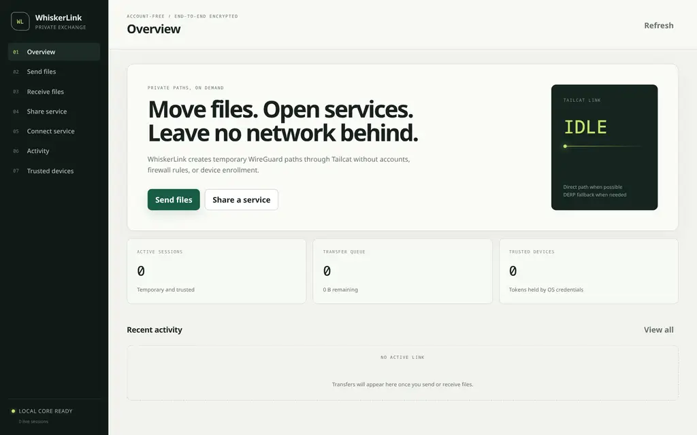

# WhiskerLink

[](https://github.com/DavidCarliez/whiskerlink/actions/workflows/ci.yml)
[](https://github.com/DavidCarliez/whiskerlink/releases/latest)
[](LICENSE)

**WhiskerLink** is a desktop application for private, account-free file transfer and TCP service sharing, powered by [Tailcat](https://github.com/tailscale/tailcat).

WhiskerLink creates an end-to-end encrypted WireGuard path between two peers. It does not modify system routes, require inbound firewall rules, or require a Tailscale account. Direct peer-to-peer connectivity is preferred; DERP provides the fallback path.

> WhiskerLink is an independent project. It is not an official Tailscale product.



## Highlights

- Send files and folders with an inspect-before-accept workflow.
- Resume interrupted GUI-to-GUI downloads from partial files.
- Verify completed files with SHA-256 before moving them into place.
- Queue, pause, resume, and review transfer activity.
- Share a local TCP service through a temporary or persistent Tailcat identity.
- Map a remote Tailcat service to an ordinary local loopback port.
- Store persistent tokens and private keys in the operating-system credential manager.
- Receive a one-file or one-folder offer with the stock Tailcat CLI—no GUI required.
- Stay available from the system tray without leaving a visible window open.

## Download

Download the current build from [GitHub Releases](https://github.com/DavidCarliez/whiskerlink/releases/latest).

Release archives are produced for:

- Linux amd64
- Windows amd64
- macOS arm64

The builds are currently unsigned. Windows SmartScreen and macOS Gatekeeper may therefore show an unverified-developer warning.

Linux requires GTK 3 and WebKitGTK 4.1 at runtime. Package names vary by distribution; common names include `gtk3` and `webkit2gtk-4.1`.

## Send files

1. Open **Send files**.
2. Choose files or choose one folder.
3. Optionally name the transfer and select the trusted host identity.
4. Create the offer.
5. Open **Activity** and copy the invite or generated receiver command.
6. Keep the session open until the receiver confirms completion.

A receiver running WhiskerLink can inspect the manifest, select files, choose a destination, and select a collision policy before accepting anything.

### Receiver without WhiskerLink

An offer containing exactly one file or one folder also exposes a read-only Tailcat SFTP service. The Activity screen generates a complete command for the receiver's operating system.

Linux, using the extracted Tailcat release binary:

```sh
./tailcat cp -r 'tcTOKEN:.' .
```

Windows, using `tailcat.exe`:

```powershell
.\tailcat.exe cp -r "tcTOKEN:." .
```

Run the command from the folder where the received content should be saved. `tailcat cp` uses the system OpenSSH `scp` command.

Tailcat's file-service API does not report read progress or completion back to the sender. CLI transfers therefore leave the offer in **LISTENING** state. Stop the session after the receiver confirms the download.

Multiple independent selections use WhiskerLink's richer transfer protocol and require WhiskerLink on the receiving side.

## Share a service

1. Open **Share service**.
2. Enter the loopback TCP port to expose and the remote Tailcat port.
3. Start sharing and send the generated invite to the recipient.
4. The recipient opens **Connect service**, supplies the invite and remote port, and chooses a local port.
5. Existing software connects to the displayed `127.0.0.1` address as if the service were local.

### Service client without WhiskerLink

The Activity screen generates a SOCKS5 proxy command for a recipient without the GUI.

Linux:

```sh
./tailcat socks --listen=127.0.0.1:1080 'tcTOKEN'
```

Windows:

```powershell
.\tailcat.exe socks --listen=127.0.0.1:1080 "tcTOKEN"
```

Keep that command running, configure the client application to use SOCKS5 proxy `127.0.0.1:1080`, and connect to `server.tailcat:8080`. For an HTTP service, the URL is `http://server.tailcat:8080/`.

This does **not** create `localhost:8080`. The shorter `tailcat tcTOKEN 8080` command only connects the terminal's standard input/output to the remote TCP stream; a browser cannot use that stream. Use WhiskerLink's **Connect service** workflow when the recipient needs an ordinary local listening port.

Only the configured TCP port is exposed. WhiskerLink does not advertise the host's other services or change its network routes.

## Security model

- A `tc…` invite is a capability. Anyone holding it can connect while the corresponding offer or service is running. Treat it as a secret.
- Temporary sessions generate an in-memory identity that disappears when the session stops.
- Persistent identities remain reachable by previously shared tokens until rotated.
- Persistent private keys and full trusted-device tokens are stored in the OS credential manager.
- SQLite stores transfer metadata, resumable offsets, and redacted token hints with owner-only permissions.
- Received paths are normalized and confined to the selected destination. Absolute paths, traversal, and symlink escapes are rejected.
- File contents are hashed before offering and verified again before a GUI download is finalized.
- Existing destination files can be renamed, skipped, or replaced only after verification.

## Development

### Requirements

- Go 1.27 or newer
- [Bun](https://bun.sh/)
- [Wails v3](https://v3.wails.io/)
- Platform WebView and compiler dependencies required by Wails

Install Wails and frontend dependencies:

```sh
go install github.com/wailsapp/wails/v3/cmd/wails3@v3.0.0-beta.16
cd frontend
bun install
cd ..
```

Run the test suite:

```sh
go test ./...
```

Run in development mode:

```sh
wails3 dev
```

Build a production binary on Linux:

```sh
wails3 build -tags gtk3
```

On Windows and macOS:

```sh
wails3 build
```

The resulting binary is written to `bin/`.

An opt-in integration test exercises a real Tailcat round trip through separate peer processes and the public DERP service:

```sh
TAILCAT_INTEGRATION=1 go test ./internal/tailnet -run TestTailcatServiceRoundTrip -count=1 -v
```

## Architecture

- **Go:** application services, Tailcat sessions, transfer protocol, integrity checks, SQLite, and credential storage.
- **Wails v3:** native window, WebView bindings, file dialogs, and system tray.
- **React + TypeScript:** desktop workflows and live activity views.
- **Tailcat:** userspace WireGuard networking, direct-path discovery, DERP fallback, and read-only SFTP compatibility.

GUI file transfers use a versioned protocol on Tailcat TCP port `43111`. CLI-compatible one-file and one-folder offers additionally expose Tailcat's read-only SFTP service on port `22`.

## Releases

Pushing a tag matching `v*` runs the release workflow. CI builds Linux, Windows, and macOS artifacts, publishes checksums, and creates the corresponding GitHub Release with generated release notes.

For example:

```sh
git tag v0.1.0
git push origin v0.1.0
```

## License

WhiskerLink is available under the [MIT License](LICENSE).

Tailcat is maintained by Tailscale and distributed under its own BSD-style license. See the [Tailcat repository](https://github.com/tailscale/tailcat) for details.
